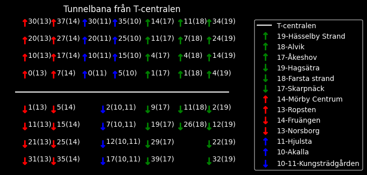

# SL_api_pythonplot
Plot metros arriving at T-centralen and minutes until arrival, 4 trains for each line, minutes until arrival at TC(subway line)

Based on https://github.com/jfjallid/Stockholm-SL-API-Python-library/blob/master/examples/travelPlans.py
